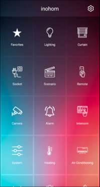

# Inohom App

This project demonstrates an Android application designed to showcase Inohom features using a WebSocket Connection. The app is developed with Kotlin, utilizing Fragments for the UI layer and OkHttp for network requests.

## Features
#####  Main Screen
- Accounts Button: Enables users to log in with static login credentials.
- Loading & Error Handling: Displays a loading indicator during data fetching and provides user-friendly error messages in case of issues.

#####  Home Screen
- Controls Fragment: Displays:
    - The current list of available controls.
- Control Detail Fragment: Displays:
    - A detailed view with a list of sub-controls.

#####  Localization
Multi-Language Support: The app supports multiple languages, ensuring accessibility for both English-speaking and Turkish users.

### Web Endpoints
This app interacts with the Inohom Web API to fetch data. The following endpoints are utilized:
|Endpoints||
|--------|--------|
| {"is_request":true,"id":8,"params":[{"username":"demo","password":"123456"}],"method":"Authenticate"} | Login |
| {"is_request":true,"id":5,"params":[{}],"method":"GetControlList"} | Get SubControls List/ Detail |
| {"is_request":true,"id":84,"params":[{"id":"a2830d60-ddff-4dad-8f3d-dfca0ded2462","value":1}],"method":"UpdateControlValue"} | SubControls Actions |

### Technologies Used
- Kotlin
    - Used for the core application logic and development.
- Hilt (Dependency Injection)
    - Simplifies dependency injection and promotes modularity and testability.
- OkHttp & Gson
    - OkHttp for efficient network requests and response handling.
    - Gson for JSON serialization and deserialization.
- Kotlin Coroutines
    - Handles asynchronous tasks and threading in a concise, structured way.
- Jetpack Libraries
    - Navigation Component with SafeArgs for navigating between fragments.
    - LiveData & ViewModel for reactive UI and lifecycle-aware data handling.
    - RecyclerView for displaying dynamic, scrollable lists.
- View Binding & Data Binding
    - Simplifies UI interactions and reduces boilerplate code.

### Architecture
The app is implemented using the MVVM (Model-View-ViewModel) design pattern to separate concerns and improve code maintainability:

1. Entity (Domain Layer)
   This layer contains the core business logic and rules of the application. It is completely independent of the UI and data sources. The entities represent the application's main business objects and encapsulate the fundamental logic of the system.

2. Use Cases (Interactor)
   This layer is responsible for the specific operations of the application. Use cases (also known as interactors) define and execute business logic for particular features or workflows. For example, a use case like AuthenticateUserUseCase would handle the process of user authentication. Use cases orchestrate interactions between the domain and other layers, ensuring the business logic remains central.

3. Repository (Data Layer)
   This layer acts as an intermediary between the domain layer and the data sources. It handles all communication with external data sources, such as WebSocket connections, RESTful APIs, local databases, or other remote services. Repositories abstract the details of data fetching or storage, providing clean interfaces to the domain layer.

4. UI (Presentation Layer)
   This layer is responsible for handling user interactions and displaying information. It consists of components like Fragments, Activities, and ViewModels. The ViewModel mediates between the UI and the domain layer, providing data and handling user inputs while maintaining a clean separation of concerns.

This structure promotes modularity, scalability, and testability by ensuring that each layer has a distinct and specific role.

### Installation: How to Run the App

To run this project locally, follow these steps:

1. Clone this repository:
    ```bash
    git clone https://github.com/oktydeniz/inohom-demo.git
    ```

   or
    ```bash
    git@github.com:oktydeniz/inohom-demo.git
    ```
2. Open the project in Android Studio:
3. Build and run the project.
4. Run the app on the simulator or a physical device.

## App Images

### Main Screens

Main Screen |
------ |
 |


### Home Screens

Controls Fragment | Control Detail Fragment
------ | --------
 | 
